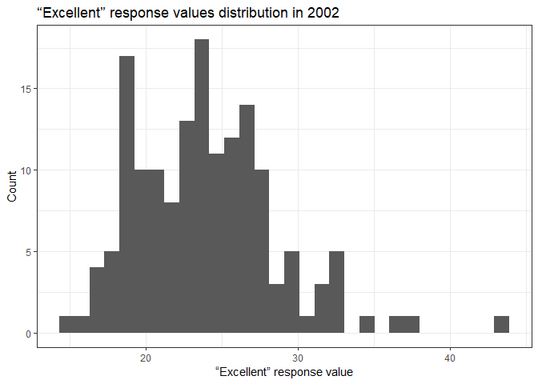
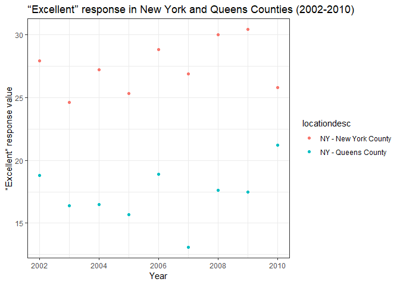

p8105\_hw2\_hq2163\_hanbo
================
Hanbo Qiu
September 30, 2018

Problem 1
---------

``` r
#Import NYC_Transit_Subway_Entrance_And_Exit_Data.csv, clean it and recode entry.
nyc_sub  = read_csv(file = "./data/NYC_Transit_Subway_Entrance_And_Exit_Data.csv") %>% 
  janitor::clean_names() %>% 
  select(line:entry, vending, ada) %>% 
  mutate(entry = recode(entry, "YES" = TRUE, "NO" = FALSE))
```

    ## Parsed with column specification:
    ## cols(
    ##   .default = col_character(),
    ##   `Station Latitude` = col_double(),
    ##   `Station Longitude` = col_double(),
    ##   Route8 = col_integer(),
    ##   Route9 = col_integer(),
    ##   Route10 = col_integer(),
    ##   Route11 = col_integer(),
    ##   ADA = col_logical(),
    ##   `Free Crossover` = col_logical(),
    ##   `Entrance Latitude` = col_double(),
    ##   `Entrance Longitude` = col_double()
    ## )

    ## See spec(...) for full column specifications.

Write a short paragraph about this dataset:

The original dataset contains variables related to subway station name, location and each entrance and exit for each subway station in NYC. I import the dataset, convert column names to lower snake case, retain column including "line, station, name, station latitude/longitude, routes served, entry, vending, entrance type, and ADA compliance" and convert the entry variable from character to a logical variable.The dimension of the dataset is 1868\*19. The data provided includes columns route1 to route10, which list all routes served by a station entrance/exit. So, I do not think it a "tidy" format, and should be restructured accordingly.

Answer questions using these data:

``` r
#Calculate the number of distinct stations. 
dist_stat = distinct(nyc_sub, line, station_name)
n_dist_stat = nrow(dist_stat)

#Calculate the numeber of these stations which are ADA compliant.
dist_stat_ada = subset(nyc_sub, ada == TRUE, select = c(station_name, line))
n_stat_ada = n_distinct(dist_stat_ada)

#Calculate the proportion of station entrances/exits without vending allow entrance.
dist_stat_vend = subset(nyc_sub, vending == "YES", select = c(line, station_name))
n_stat_vend = n_distinct(dist_stat_vend)
prop_stat_vend = (n_dist_stat-n_stat_vend)/n_dist_stat
```

There are 465 distinct stations. Among them, 84 are ADA compliant. The proportion of station entrances / exits without vending allow entrance is 0.0064516.

Reformat data：

``` r
#Reformat data using route number and route name.
nyc_route = gather(nyc_sub, key = route_number, value = route_name, route1: route11)

#Caculate the number of distinct stations serve the A train.
stat_a = subset(nyc_route,route_name == "A")
dist_stat_a = distinct(stat_a, line, station_name)
n_dist_stat_a = nrow(dist_stat_a)

#Caculate the number of distinct stations which serve A train is ADA compliant.
stat_a_ada = subset(stat_a, ada == TRUE)
a_stat_ada = distinct(stat_a_ada, line, station_name)
n_a_stat_ada = nrow(a_stat_ada)
```

There are 60 distinct stations serve the A train. Of the stations that serve the A train, ADA compliant is 17.

Problem 2
---------

``` r
#Read and clean the Mr. Trash Wheel sheet. Round the sports_balls to integer.
library(readxl)
trash_wheel = read_excel("./data/HealthyHarborWaterWheelTotals2017-9-26.xlsx", 
                         sheet = "Mr. Trash Wheel", 
                         range = cell_cols("A:N")) %>% 
   janitor::clean_names() %>% 
   filter(!is.na(dumpster)) %>% 
   mutate(sports_balls = as.integer(round(sports_balls, digits = 0)))
```

``` r
#Read and clean 2017 precipitation data.
precip_2017 = read_excel("./data/HealthyHarborWaterWheelTotals2017-9-26.xlsx",
                         sheet = "2017 Precipitation",
                         skip = 1,
                         n_max = 12) %>% 
  janitor::clean_names() %>%
  mutate(year = 2017) %>%
  filter(!is.na(total)) %>% 
  select(year, everything()) 

#Read and clean 2016 precipitation data.
precip_2016 = read_excel("./data/HealthyHarborWaterWheelTotals2017-9-26.xlsx",
                         sheet = "2016 Precipitation",
                         skip = 1,
                         n_max = 12) %>% 
  janitor::clean_names() %>%
  mutate(year = 2016) %>%
  filter(!is.na(total)) %>% 
  select(year, everything()) 

#Combine the 2 datasets, convert month to character.
precip_16_17 = bind_rows(precip_2017,precip_2016) %>% 
  mutate(month = factor(month, levels = 1:12, labels = month.name),
         month = as.character(month))

#Calculate the number of observations in Trash Wheel sheet.
n_trash_wheel = nrow(trash_wheel)

#Calculate the number of observations in precipitation data. 
n_precip_16_17 = nrow(precip_16_17)

#Calculate the total precipitation in 2017.
total_precip_2017 = sum(precip_2017$total)

#Calculate the median number of sports balls in a dumpster in 2016.
ball_2016 = subset(trash_wheel, year == 2016, select = sports_balls)
median_ball = median(ball_2016$sports_balls)
```

The number of observations in Trash Wheel sheet is 216 and the number of observations in precipitation data is 20. Some key variables are year, month because they are the connection between two database. The total precipitation in 2017 is 29.93. The median number of sports balls in a dumpster in 2016 is 26.

Problem 3
---------

``` r
#Use code "data(package = "p8105.datasets")" to find the name of target dataset and load it.
data(brfss_smart2010)

#Create an overall_heal dataset and focus on the “Overall Health” topic and tidy the dataset. 
#Add a variables "prop_over_good" indicating the proportion of “Excellent” or “Very Good”.
overall_heal = janitor::clean_names(brfss_smart2010) %>% 
  filter(topic == "Overall Health") %>% 
  select(-c(class:question, sample_size, confidence_limit_low:geo_location)) %>% 
  spread(key = response, value = data_value) %>%
  janitor::clean_names() %>% 
  mutate(prop_over_good =  excellent + very_good)
```

``` r
#Calculate the number of unique locations.
dist_loc = distinct(overall_heal, locationabbr, locationdesc)
n_dist_loc = nrow(dist_loc)

#Calculate the number of states.
dist_state = distinct(dist_loc, locationabbr)
n_dist_state = nrow(dist_state)

#Calculate the most observed state. 
state_most_obser = count(dist_loc, locationabbr, sort = TRUE)

#Calculate the median of the “Excellent” response value in 2002.
resp_2002 = subset(overall_heal, year == 2002) 
median_2002_excellent = median(resp_2002$excellent, na.rm = TRUE)
```

There are 404 unique locations in the dataset. Every state is represented. FL state is observed the most.In 2002, The median of the “Excellent” response value is 23.6.

Below is a histogram of the distribution of “Excellent” response values in the year 2002.

``` r
#Draw the histogram.
ggplot(resp_2002, aes(x = excellent)) + 
  geom_histogram()+
  labs(title = "“Excellent” response values distribution in 2002",
       x = "“Excellent” response value", y = "Count") +
  theme_bw()
```

    ## `stat_bin()` using `bins = 30`. Pick better value with `binwidth`.

    ## Warning: Removed 2 rows containing non-finite values (stat_bin).



Below is a scatterplot showing the proportion of “Excellent” response values in New York County and Queens County (both in NY State) in each year from 2002 to 2010.

``` r
#Create a subset dataset only contains "New York County" & "Queens County".
resp_NYC_QC = subset(overall_heal, locationdesc %in% c(str_c("NY - ", c("New York County", "Queens County"))))
#Draw the scatterplot.
ggplot(resp_NYC_QC, aes(x = year, y = excellent, colour = locationdesc)) + 
  geom_point() +
  labs(title = "“Excellent” response values in New York County and Queens County (2002-2010)", 
       x = "Year", y = "“Excellent” response value") +
  theme_bw()
```


